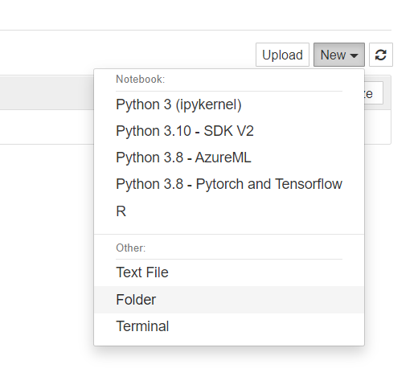
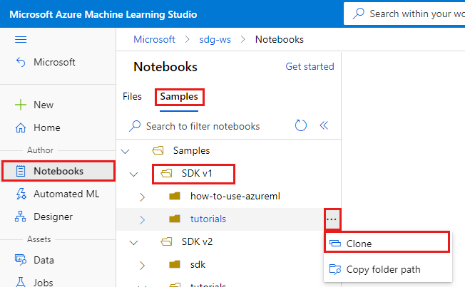
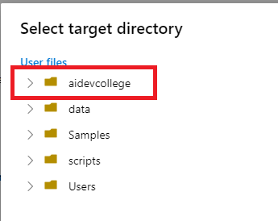

# Challenge 1 - Basic model training on Azure

## Setup part

1. In the Azure Portal, first we create a `Resource Group` and name it `aidevcollege`:


1. Once the Resource Group is created, select **+ Create a resource** in the upper-left corner of the Azure portal.

1. Use the search bar to find **Machine Learning**.

1. Select **Machine Learning**.

1. In the Machine Learning pane, select **Create** to begin.


1. Use the following inputs to create the Azure Machine Learning Workspace:

* Workspace name: `aidevcollege`
* Resource Group: `aidevcollege`
* Location: `West Europe`
* Leave the rest as default and create the service.

It should look like this:


Let's have a look at our Resource Group, which should look like this:


As you can see, more resources apart from the intended Machine Learning workspace have also been created. This was done automatically for you. Their tasks are the following:

* Application Insights - used for monitoring our models in production (will be used later).
* Storage account - this will store our logs, model outputs, training/testing data, etc.
* Key vault - stores our secrets.
* Machine Learning service workspace - the center point for Machine Learning on Azure.

Now we can either launch the `Machine Learning service workspace` from the portal or we can open the [Azure Machine Learning Studio](https://ml.azure.com/) directly.

## Creating a Compute Instance

1. Launch the `Machine Learning service workspace` and navigate to **Compute** so we can create a new `Compute Instance.`

A [compute instance](https://learn.microsoft.com/en-us/azure/machine-learning/concept-compute-instance) can be used as fully configured and managed development environment in the cloud for machine learning. It actually sits inside this `Machine Learning service workspace` and is a **regular Azure Virtual Machine**.

**The [Azure Machine Learning Service Workspace](https://learn.microsoft.com/en-us/azure/machine-learning/concept-workspace) is the "umbrella" that groups all your machine learning resources.**


2. Hit `Create`, select `STANDARD_D3_V2` and give it a unique name:


It'll take a few minutes until the Compute Instance has been created. In this exercise, we'll use this Compute Instance to train a simple Machine Learning model using Jupyter notebooks.

In a real-world setup, we might consider using a GPU-enabled instance, in case we need to perform Deep Learning or just rely on Azure Machine Learning Compute.

Once the Compute Instance is running, the UI will already give us links to `Jupyter`, `JupyterLab` and `RStudio`. To keep things simple, we'll use `Jupyter` throughout this college, but if you feel adventurous, use `JupyerLab` or `RStudio` solving the challenges in R.


## Initial Azure Machine Learning Setup

Inside the newly created Compute Instance, first create a new folder via the `New` button on the top right of Jupyter. *Everything we'll do in this workshop should happen in this folder*. We will call this **folder:** `aidevcollege`. This is because Machine Learning Services will persist the whole contents of the experiment's folder, which exceeds the limit when you run your Jupyter Notebooks in the root folder.



> **Note:** The next paragraph is **not** needed, but you'd need it if you want to connect to your Azure Machine Learning Workspace from e.g., your local machine. Since the `Compute Instance` runs inside the workspace, it automatically connects to the workspace it lives in.

<details>
Next, create a text file called `config.json` (also via the `New` button) and replace the values with your own (you'll find your Subscription ID in the Azure Portal at the top of your Resource Group):

```json
 # Ignore this block, unless you run Jupyter directly on e.g., your laptop
 {
    "subscription_id": "xxxxxxx-xxxx-xxxx-xxxx-xxxxxxxxx",
    "resource_group": "
 ",
    "workspace_name": "aidevcollege"
 }
 ```


</details>


## Clone a notebook folder

In this part you will complete the following experiment setup and run steps in a Jupyter Notebook provided by Azure Machine Learning. To use it, you will need to clone it into your `aidevcollege` folder.

1. On the left, select **Notebooks**.

1. At the top, select the **Samples** tab, open the **SDK v1** folder and select the **tutorials** folder. Right click it and select **Clone**.



7. A list of folders shows each user who accesses the workspace. Select your `aidevcollege` folder to clone the **tutorials** folder there.



## Open the cloned notebook

1. Return to the Jupyter Notebook landing page that was previously accessed using the Azure Machine Learning UI.


1. Open the **tutorials** folder that was cloned into your `aidevcollege` folder.

1. Select the **quickstart-azureml-in-10mins.ipynb** file from your **aidevcollege/quickstart-azureml-in-10mins** folder and open it. 


## Install packages

1. Open the notebook **quickstart-azureml-in-10mins.ipynb**.

1. Once the Jupyter Notebook is open, the compute instance is running and the kernel appears, add a new code cell to install packages needed for this tutorial.  

    > To quickly create **new cells** you select the **first cell** (make sure it is in *Code mode* and highlighted by the color blue) and type **`b`** it will add another cell *below* the first cell. 

1. At the top of the notebook, add a code cell.


1. Add the following code into the cell and then run the cell, either by using the **Run** tool or by using **Shift+Enter**.

    ```bash
    %pip install scikit-learn==0.22.1
    %pip install scipy==1.5.2
    ```

    You may see a few install warnings. These can safely be ignored.

## Run the notebook

This tutorial and accompanying **utils.py** file is also available on [GitHub](https://github.com/Azure/MachineLearningNotebooks/tree/master/tutorials) if you wish to use it on your own [local environment](how-to-configure-environment-v1.md). If you aren't using the compute instance, add `%pip install azureml-sdk[notebooks] azureml-opendatasets matplotlib` to the install above.

> **The rest of this training contains the same content as you see in the notebook.**  
>
> Switch to the Jupyter Notebook now if you want to run the code while you read along.
> To run a single code cell in a notebook, click the code cell and hit **Shift+Enter**. Or, run the entire notebook by choosing **Run all** from the top toolbar.

## Import data

Before you train a model, you need to understand the data you're using to train it. In this section, learn how to:

* Download the MNIST dataset
* Display some sample images

You'll use Azure Open Datasets to get the raw MNIST data files. Azure Open Datasets are curated public datasets that you can use to add scenario-specific features to machine learning solutions for better models. Each dataset has a corresponding class, `MNIST` in this case, to retrieve the data in different ways.


```python
import os
from azureml.opendatasets import MNIST

data_folder = os.path.join(os.getcwd(), "/tmp/qs_data")
os.makedirs(data_folder, exist_ok=True)

mnist_file_dataset = MNIST.get_file_dataset()
mnist_file_dataset.download(data_folder, overwrite=True)
```

### Take a look at the data

Load the compressed files into `numpy` arrays. Then use `matplotlib` to plot 30 random images from the dataset with their labels above them. 

Note this step requires a `load_data` function that's included in an `utils.py` file. This file is placed in the same folder as this notebook. The `load_data` function simply parses the compressed files into numpy arrays.

```python
from utils import load_data
import matplotlib.pyplot as plt
import numpy as np
import glob


# note we also shrink the intensity values (X) from 0-255 to 0-1. This helps the model converge faster.
X_train = (
    load_data(
        glob.glob(
            os.path.join(data_folder, "**/train-images-idx3-ubyte.gz"), recursive=True
        )[0],
        False,
    )
    / 255.0
)
X_test = (
    load_data(
        glob.glob(
            os.path.join(data_folder, "**/t10k-images-idx3-ubyte.gz"), recursive=True
        )[0],
        False,
    )
    / 255.0
)
y_train = load_data(
    glob.glob(
        os.path.join(data_folder, "**/train-labels-idx1-ubyte.gz"), recursive=True
    )[0],
    True,
).reshape(-1)
y_test = load_data(
    glob.glob(
        os.path.join(data_folder, "**/t10k-labels-idx1-ubyte.gz"), recursive=True
    )[0],
    True,
).reshape(-1)


# now let's show some randomly chosen images from the traininng set.
count = 0
sample_size = 30
plt.figure(figsize=(16, 6))
for i in np.random.permutation(X_train.shape[0])[:sample_size]:
    count = count + 1
    plt.subplot(1, sample_size, count)
    plt.axhline("")
    plt.axvline("")
    plt.text(x=10, y=-10, s=y_train[i], fontsize=18)
    plt.imshow(X_train[i].reshape(28, 28), cmap=plt.cm.Greys)
plt.show()
```
The code above displays a random set of images with their labels, similar to this:


## Train model and log metrics with MLflow

You'll train the model using the code below. Note that you are using [MLflow autologging to track metrics](https://learn.microsoft.com/en-us/azure/machine-learning/concept-mlflow#tracking-with-mlflow) and log model artifacts.

You'll be using the [LogisticRegression](https://scikit-learn.org/stable/modules/generated/
.linear_model.LogisticRegression.html) classifier from the [SciKit Learn framework](https://scikit-learn.org/) to classify the data.

> **The model training takes approximately 2 minutes to complete.**

```python
# create the model
import mlflow
import numpy as np
from sklearn.linear_model import LogisticRegression
from azureml.core import Workspace

# connect to your workspace
ws = Workspace.from_config()

# create experiment and start logging to a new run in the experiment
experiment_name = "azure-ml-in10-mins-tutorial"

# set up MLflow to track the metrics
mlflow.set_tracking_uri(ws.get_mlflow_tracking_uri())
mlflow.set_experiment(experiment_name)
mlflow.autolog()

# set up the Logistic regression model
reg = 0.5
clf = LogisticRegression(
    C=1.0 / reg, solver="liblinear", multi_class="auto", random_state=42
)

# train the model
with mlflow.start_run() as run:
    clf.fit(X_train, y_train)
```

## View experiment

In the left-hand menu in Azure Machine Learning studio, select __Jobs__ and then select your job (__azure-ml-in10-mins-tutorial__). A job is a grouping of many runs from a specified script or piece of code.  Multiple jobs can be grouped together as an experiment.

Information for the run is stored under that job. If the name doesn't exist when you submit a job, if you select your run you will see various tabs containing metrics, logs, explanations, etc.

## Version control your models with the model registry

You can use model registration to store and version your models in your workspace. Registered models are identified by name and version. Each time you register a model with the same name as an existing one, the registry increments the version. The code below registers and versions the model you trained above. Once you have executed the code cell below you will be able to see the model in the registry by selecting __Models__ in the left-hand menu in Azure Machine Learning studio.

```python
# register the model
model_uri = "runs:/{}/model".format(run.info.run_id)
model = mlflow.register_model(model_uri, "sklearn_mnist_model")
```

## What we have learned so far

* We've trained a Machine Learning model using scikit-learn inside a `Compute Instance` running `Jupyter`
* Azure ML knows about our experiment and our initial run and tracked metrics
* We have registered our initial model as a Azure ML Model in our Workspace

In the [next challenge](challenge_02.md), we'll deploy our model to an Azure Container Instance to make it available as an endpoint.
