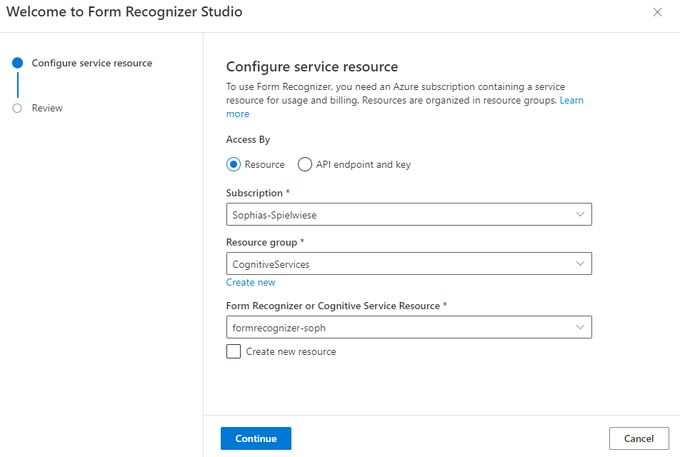

# AI Developer College Day2 - Form Recognizer

Azure Form Recognizer is a cloud-based [Azure Applied AI Service](https://learn.microsoft.com/en-us/azure/applied-ai-services/?view=form-recog-3.0.0) for developers to build intelligent document processing solutions. Form Recognizer applies machine-learning-based optical character recognition (OCR) and document understanding technologies to extract text, tables, structure, and key-value pairs from documents. You can also label and train custom models to automate data extraction from structured, semi-structured, and unstructured documents.

## Focus of Today:

Form recognizer comes with a selection of prebuilt models. It is also possible to build and train your own custom model for your specific needs. In the following challenges you will try out the different options you have when using Form Recognizer.

## Here is what you will learn

- Deploy the service
- Operate the User Interface (Form Recognizer Studio)
- Utilise Form Recognizer's prebuilt models
- Build custom models

## Challenges

1. Create Form Recognizer resource: westeurope, pricing tier free F0
1. Get key and endpoint

## Create Form Recognizer resource

Before we can start using Form Recognizer, we first need to deploy the resource in Azure. We will do this using the Azure CLI.

Like in the challenges before, open the cloud shell in the Azure portal. To ensure you are using the correct Azure subscription, type ```az account show``` and to change the subscription type ```az account set --subscription <NAME OR ID OF YOUR SUBSCRIPTION>```.

Next copy the following command, edit the needed information and paste the command into your cloud shell.

```bash
az cognitiveservices account create --name 'formrecognizer'-$prefix --resou
rce-group <NAME OF YOUR RESOURCE GROUP> --kind FormRecognizer --sku F0 --location westeurope
```
**Hint**: In case you have already created a Form Recognizer resource with the free tier (F0) previously, change the sku to "S0".

Now we need to get the key and endpoint of our resource.

```bash
az cognitiveservices account keys list --name 'formrecognizer'-$prefix --resource-group <NAME OF YOUR RESOURCE GROUP>
```


## Form Recognizer model types

As mentioned before, Form Recognizer has a selection of models you can leverage. In the following, you will get to try out a few of them.

### Read OCR Model

The [Form Recognizer Read OCR Model](https://learn.microsoft.com/en-us/azure/applied-ai-services/form-recognizer/concept-read?view=form-recog-3.0.0) extracts print and handwritten text from PDF documents and scanned images. It detects paragraphs, text lines, words, locations, and languages. The read model is the underlying OCR engine for other Form Recognizer prebuilt models like Layout, General Document, Invoice, Receipt, Identity (ID) document, in addition to custom models.

You will be trying this out using the User Interface - Form Recognizer Studio.

1. Go to the [Form Recognizer Studio](https://formrecognizer.appliedai.azure.com/studio) and click on _Read_.
1. In the pop-up window, select your Azure subscription, resource group and Form Recognizer resource.
</br>


1. You can analyse the sample document or upload your own sample.

1. Select the _Analyze_ button.

It is also possible to utilise the Form Recognizer APIs using the SDK or RestAPI. In the following, you will be leveraging the Prebuilt Invoice Model using the Python SDK.

### Invoice Model 

The Form Recognizer [invoice model](https://learn.microsoft.com/en-us/azure/applied-ai-services/form-recognizer/concept-invoice?view=form-recog-3.0.0) combines powerful Optical Character Recognition (OCR) capabilities with invoice understanding models to analyze and extract key fields and line items from sales invoices. Invoices can be of various formats and quality including phone-captured images, scanned documents, and digital PDFs. The Form Recognizer invoice model combines powerful Optical Character Recognition (OCR) capabilities with invoice understanding models to analyze and extract key fields and line items from sales invoices. Invoices can be of various formats and quality including phone-captured images, scanned documents, and digital PDFs.

### Receipt Model

The Form Recognizer [receipt model](https://learn.microsoft.com/en-us/azure/applied-ai-services/form-recognizer/concept-receipt?view=form-recog-3.0.0) combines powerful Optical Character Recognition (OCR) capabilities with deep learning models to analyze and extract key information from sales receipts. Receipts can be of various formats and quality including printed and handwritten receipts. The API extracts key information such as merchant name, merchant phone number, transaction date, tax, and transaction total and returns structured JSON data.

Please not that the receipt model does currently not support German language receipts.

Perform in studio

### Custom Model

With Form Recognizer, you can use prebuilt or pre-trained models, of which we have introduced you to some previously. Moreover, you can train standalone [custom models](https://learn.microsoft.com/en-us/azure/applied-ai-services/form-recognizer/concept-custom?view=form-recog-3.0.0). Custom models extract and analyze distinct data and use cases from forms and documents specific to your business.

Perform in studio

Now that you have tried a selection of Form Recognizer models, you might be wondering which is the right one for your use case. This [table](https://learn.microsoft.com/en-us/azure/applied-ai-services/form-recognizer/overview?view=form-recog-3.0.0#which-form-recognizer-model-should-i-use) will give you an overview of which model to use.